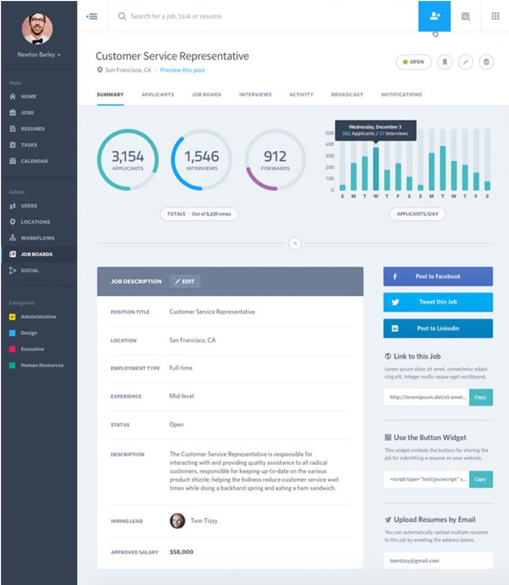

## Static Comp Challenge 3

Last of the three html/css challenges in Mod 1. The aim of the project was to recreate the comp. 
Breakpoints for responsive leayouts were not provided, students used their own judgement to create medium and small device layouts.
Creative license was given in regards to images, icons and copy.

#### Original Comp:

#### Original Assignment: 
[Turing Project](http://frontend.turing.io/projects/m1-static-comp-3.html)

#### Link to my project:
https://justynafield.github.io/jf-comp-challenge-3/

